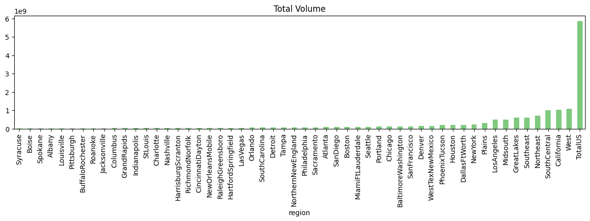
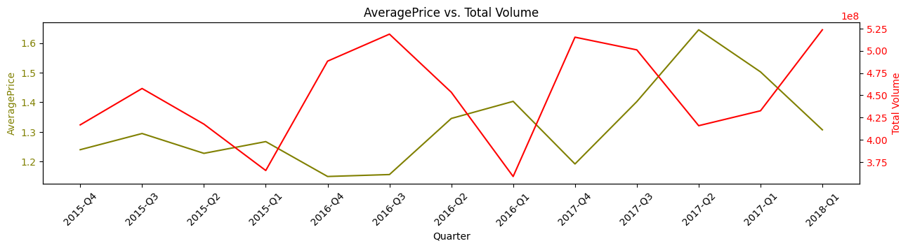
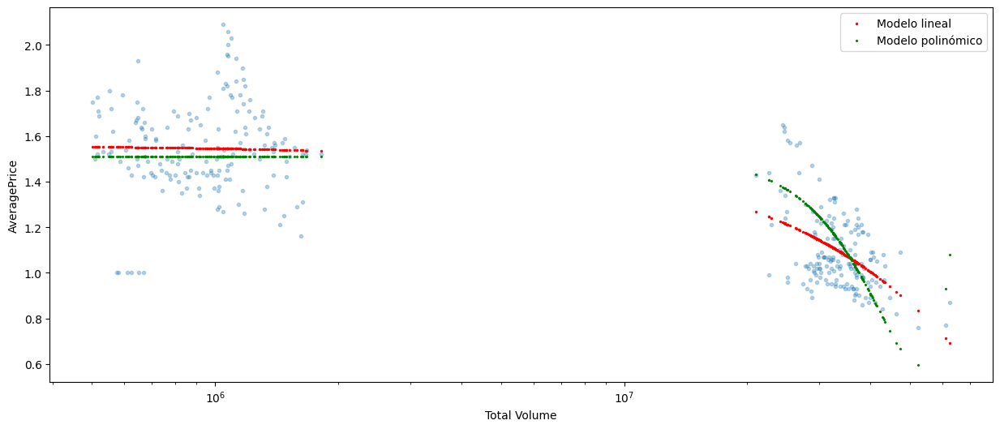

Análisis de datos exploratorio (EDA) del conjunto de datos de precios de aguacate con un equipo de tres personas. Esta estructura divide los objetivos del análisis en fases para que cada persona pueda trabajar en actividades paralelas y contribuir de manera efectiva al proyecto.

### Ingrantes del equipo

- Konstantinos Avramidis
- Breysi Ramirez Rodriguez
- Germán Zeitz Lalanne

---

### **Planificación del EDA: Análisis de Datos de Precios de Aguacate**

1. **Definir Objetivos del Análisis (Reunión Inicial)**
   - **Descripción**: Determinar los objetivos del EDA y los resultados esperados.
   - **Tareas**:
     - Revisar y validar la estructura del dataset.
     - Aclarar qué análisis se realizará (análisis de series temporales, estacionalidad, elasticidad del precio, visualización de datos).
   - **Responsable**: Equipo completo.

---

### **Fase 1: Limpieza y Preparación de los Datos**
   
2. **Cargar y Revisar el Dataset**
   - **Descripción**: Cargar el dataset de precios de aguacate y revisar la estructura de columnas y datos.
   - **Tareas**:
     - Verificar datos faltantes o inconsistentes.
     - Convertir columnas de fecha (`Date`) al tipo `datetime`.
     - Ajustar el formato de columnas numéricas.
   - **Responsable**: Persona 1.

3. **Tratar Valores Faltantes y Datos Atípicos**
   - **Descripción**: Identificar y manejar datos faltantes o atípicos.
   - **Tareas**:
     - Analizar la distribución de valores y gestionar datos atípicos.
     - Reemplazar o eliminar valores faltantes según corresponda.
   - **Responsable**: Persona 1.

4. **Agrupación y Preprocesamiento**
   - **Descripción**: Agrupar datos por regiones, fechas y categorías (orgánicos vs. convencionales).
   - **Tareas**:
     - Generar nuevas columnas, si es necesario, para facilitar el análisis de estacionalidad y tendencias.
     - Agrupar datos de `AveragePrice` y `Total Volume` por meses y años.
   - **Responsable**: Persona 2.

---

### **Fase 2: Análisis Exploratorio de Datos y Visualización**
   
5. **Análisis de Series Temporales y Estacionalidad**
   - **Descripción**: Examinar tendencias y patrones estacionales en el precio promedio y volumen de ventas.
   - **Tareas**:
     - Descomponer la serie temporal de `AveragePrice` utilizando `seasonal_decompose`.
     - Analizar estacionalidad y tendencia en diferentes regiones.
     - Visualizar precios y ventas por mes y año.
   - **Responsable**: Persona 2.

6. **Visualización de Datos de Ventas por Región y Tipo de Aguacate**
   - **Descripción**: Explorar cómo se distribuyen los precios y volúmenes en diferentes regiones y tipos de aguacates.
   - **Tareas**:
     - Gráficos de violín para `Total Volume` por región.
     - Boxplots para comparar precios promedio por año.
     - Histogramas y gráficos de dispersión para entender la distribución y relaciones entre variables.
   - **Responsable**: Persona 3.

---

### **Fase 3: Análisis de Elasticidad y Cohortes**

7. **Elasticidad Precio-Demanda**
   - **Descripción**: Calcular la elasticidad del precio de la demanda para evaluar la sensibilidad de la demanda ante cambios en el precio.
   - **Tareas**:
     - Calcular elasticidad anual en `Total Volume` y `AveragePrice`.
     - Comparar elasticidad en diferentes regiones y tipos de aguacates.
   - **Responsable**: Persona 1.

8. **Análisis de Cohortes de Precios y Ventas**
   - **Descripción**: Realizar análisis de cohortes para observar el comportamiento del mercado a lo largo del tiempo.
   - **Tareas**:
     - Cohortes trimestrales para observar cambios en `AveragePrice` y `Total Volume`.
     - Comparar cohortes de diferentes regiones y tipos de bolsa.
   - **Responsable**: Persona 2.

---

### **Fase 4: Análisis de Correlación y Regresión**

9. **Matriz de Correlación y Análisis de Dispersión**
   - **Descripción**: Examinar la relación entre variables y buscar correlaciones significativas.
   - **Tareas**:
     - Generar matriz de correlación para columnas numéricas.
     - Visualizar correlaciones con un `heatmap`.
     - Crear gráficos de dispersión entre `AveragePrice` y `Total Volume` y ajustar una línea de regresión.
   - **Responsable**: Persona 3.

10. **Modelado de Regresión**
    - **Descripción**: Aplicar modelos de regresión para predecir precios y analizar el impacto de las variables en `AveragePrice`.
    - **Tareas**:
      - Regresión múltiple usando variables como `Total Volume`, `4046`, `4225`, `4770`, `Total Bags`.
      - Comparar modelos de regresión lineal y polinómica.
    - **Responsable**: Persona 3.

---

### **Fase 5: Conclusiones y Presentación del Informe Final**
   
11. **Interpretación de Resultados y Conclusiones**
    - **Descripción**: Resumir los resultados clave y obtener conclusiones del análisis.
    - **Tareas**:
      - Identificar patrones de precios y ventas.
      - Interpretar la elasticidad de la demanda y el impacto de diferentes factores en `AveragePrice`.
    - **Responsable**: Equipo completo.

12. **Documentación y Presentación**
    - **Descripción**: Compilar los hallazgos y preparar una presentación para exponer los resultados.
    - **Tareas**:
      - Crear un informe con visualizaciones y análisis.
      - Preparar una presentación final para comunicar los hallazgos de manera clara.
    - **Responsable**: Equipo completo.

---

### Metodología ágil

Para abordar este análisis mediante una metodología ágil, vamos a estructurar el trabajo en iteraciones cortas o "sprints". Cada sprint tendrá una duración de 1 semana, con entregas de valor al final de cada uno para mantener el progreso continuo y asegurar que el equipo se adapta rápidamente a cualquier cambio o mejora que se necesite.

Aquí está el desglose de la metodología ágil aplicada a este proyecto de análisis exploratorio de datos (EDA) en conjunto de tres personas:

---

### **Sprint 1 (4 días): Preprocesamiento, Análisis de Series Temporales y Visualización**
  
#### **Objetivo**: Limpiar y preparar los datos, explorar tendencias de tiempo y visualizar datos clave.

#### **Actividades**:
1. **Preprocesamiento de Datos**:
   - Importación y limpieza de datos: eliminación de valores nulos y conversión de tipos de datos.
   - Estandarización de columnas y estructura para facilitar análisis.

2. **Análisis de Series Temporales**:
   - Análisis de estacionalidad por región, precios promedio mensuales y cambios anuales.
   - Identificación de patrones y tendencias de venta y precio en el tiempo.

3. **Visualización de Datos**:
   - Gráfico de violín para distribución de volumen por región y boxplot comparativo de precios.
   - Histograma del volumen total de ventas y gráficos de barras por tipo de bolsa y año.

#### **Entregable**: Conjunto de datos limpios, análisis inicial de series temporales y visualizaciones básicas con hallazgos preliminares.

---

### **Sprint 2 (4 días): Análisis de Elasticidad, Cohortes, Correlación y Regresión**
  
#### **Objetivo**: Analizar sensibilidad de precios, comportamiento por cohortes y relaciones entre variables.

#### **Actividades**:
1. **Análisis de Elasticidad del Precio**:
   - Cálculo de elasticidad precio-demanda anual y por región.
   - Gráficos de elasticidad según tamaño de bolsa y tipo de aguacate (orgánico vs. convencional).

2. **Análisis de Cohortes**:
   - Cohortes basadas en precios promedio trimestrales por región y tipo de bolsa.
   - Visualización de retención de ventas y evolución de cohortes a lo largo del tiempo.

3. **Análisis de Correlación y Regresión**:
   - Matriz de correlación entre variables clave.
   - Modelos de regresión lineal para identificar y predecir relaciones significativas.

#### **Entregable**: Informe final de elasticidad, cohortes y regresión con conclusiones clave y gráficos interpretativos.

---

### **Reunión Final y Documentación**
  
- **Objetivo**: Consolidar resultados y generar un informe final.
- **Actividades**: Integrar hallazgos de ambos sprints, documentación de proceso y recomendaciones.
- **Herramientas**: Google Docs para el informe, GitHub o Colab para el código, y Google Slides para la presentación final.

Este enfoque compacto en dos sprints permite lograr el análisis completo y entregar resultados significativos en una semana y media. Permitiendo que el equipo trabaje en paralelo, entregue resultados incrementales y adapte el análisis de acuerdo a las necesidades y descubrimientos de cada sprint.

### Observaciones sobre los Datos

1. Existen datasets solapados que alteran los análisis, Separamos los datos por tipo de `region`

   

1. El cómputo de `Bags` es coherente, suma coincide con el total (si se trabaja en enteros solo faltan 10)

   

1. Bajada de precio alrededor de febrero, posiblemente debido a picos de venta

   

1. Posible error en `AveragePrice` de tipo `organic` de julio 2015 son incoherentes entre `TotalUS` (1.00) y el resto de datasets `Regional` (1.71) y `local` (1.76)

   

1. se observa un incremento de volumen de tipo `organic`

   

1. Pico de volumen a principios de febrero y mayo [`2018-02-04`, `2017-02-05`, `2016-02-07`, `2017-05-07`, `2016-05-08`, `2015-02-01`]

   

1. se dispara en verano la venta de `XLarge Bags` a partir de 2016

   

1. No se vendieron `XLarge Bags` de tipo `organic` hasta agosto de 2017

   

1. alteraciones en la elasticidad de la demanda por la variación del precio en algunas ciudades

   

1. La elasticidad tiende a 0 a medida que avanza el tiempo, mentras que en 2015 es de -250 en 2018 es de -50

   

1. Existe un consumo orientado a comprar mayor volumen a un precio más bajo, pero tambien hay un consumo de poco volumen a precios medios/altos
1. hay tres clusters importantes de consumo: 
   - Volumen alto/precio medio: v(10⁸) $(0.8-1.6): para Small y Large Bags 
   - Volumen medio: v(10⁶) $(0.8-2.0): para todo tamaño de bolsa 
   - Volumen bajo/precio alto: v(10⁴) $(1.3-2.0): para `XLarge Bags` 

   

1. existe clara relación opuesta entre el `AveragePrice` y el `Total Volume` que podría indicar que la subida de una condiciona la otra

   

1. mientras que el `AveragePrice` de `organic` se mantiene dos puntos porcentuales por encima del `conventional`, el `Total Volume` se mantiene a dos ordenes de magnitud por debajo

   

1. La tendencia está condicionada por las `Small Bags` (75,9%) y una presencia anegdótica de `XLarge Bags` (1,3%)

   

   

   

1. Alta correlación entre `Total Volume` y (`Small Volume`, `Large Volume`,`XLarge Volume`) lo que podría indicar (erroneamente) que las tres son una segmentación de `Total Volume`
Total Volume: 15523402593.400002 **NO** es la Suma de Small Volume, Large Volume y XLarge Volume: 11150188799.32 diferencia: 4373213794.080002

   

1. La mejor predicción (96,16% +- 0,071) se obtiene filtrando cada localidad usando las 4 columnas de `Volume`
   - La segunda mejor (93,15% +- 0,074) es usando `TotalUS` y las 4 columnas `Volume`

   
   
1. Las pruebas realizadas con diferentes sets de datos y filtros no consiguen predecir de manera fiable el precio basandonos en años anteriores

   

