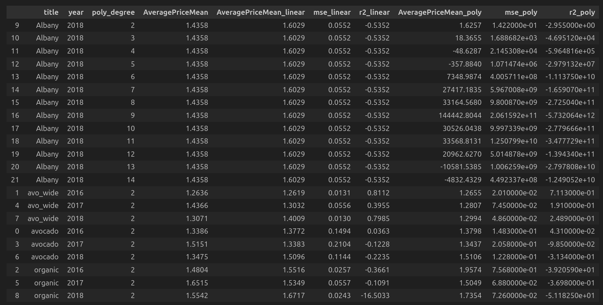

Análisis de datos exploratorio (EDA) del conjunto de datos de precios de aguacate con un equipo de tres personas. Esta estructura divide los objetivos del análisis en fases para que cada persona pueda trabajar en actividades paralelas y contribuir de manera efectiva al proyecto.

### Ingrantes del equipo

- Konstantinos Avramidis
- Breysi Ramirez Rodriguez
- Germán Zeitz Lalanne

---

### **Planificación del EDA: Análisis de Datos de Precios de Aguacate**

1. **Definir Objetivos del Análisis (Reunión Inicial)**
   - **Descripción**: Determinar los objetivos del EDA y los resultados esperados.
   - **Tareas**:
     - Revisar y validar la estructura del dataset.
     - Aclarar qué análisis se realizará (análisis de series temporales, estacionalidad, elasticidad del precio, visualización de datos).
   - **Responsable**: Equipo completo.

---

### **Fase 1: Limpieza y Preparación de los Datos**
   
2. **Cargar y Revisar el Dataset**
   - **Descripción**: Cargar el dataset de precios de aguacate y revisar la estructura de columnas y datos.
   - **Tareas**:
     - Verificar datos faltantes o inconsistentes.
     - Convertir columnas de fecha (`Date`) al tipo `datetime`.
     - Ajustar el formato de columnas numéricas.
   - **Responsable**: Persona 1.

3. **Tratar Valores Faltantes y Datos Atípicos**
   - **Descripción**: Identificar y manejar datos faltantes o atípicos.
   - **Tareas**:
     - Analizar la distribución de valores y gestionar datos atípicos.
     - Reemplazar o eliminar valores faltantes según corresponda.
   - **Responsable**: Persona 1.

4. **Agrupación y Preprocesamiento**
   - **Descripción**: Agrupar datos por regiones, fechas y categorías (orgánicos vs. convencionales).
   - **Tareas**:
     - Generar nuevas columnas, si es necesario, para facilitar el análisis de estacionalidad y tendencias.
     - Agrupar datos de `AveragePrice` y `Total Volume` por meses y años.
   - **Responsable**: Persona 2.

---

### **Fase 2: Análisis Exploratorio de Datos y Visualización**
   
5. **Análisis de Series Temporales y Estacionalidad**
   - **Descripción**: Examinar tendencias y patrones estacionales en el precio promedio y volumen de ventas.
   - **Tareas**:
     - Descomponer la serie temporal de `AveragePrice` utilizando `seasonal_decompose`.
     - Analizar estacionalidad y tendencia en diferentes regiones.
     - Visualizar precios y ventas por mes y año.
   - **Responsable**: Persona 2.

6. **Visualización de Datos de Ventas por Región y Tipo de Aguacate**
   - **Descripción**: Explorar cómo se distribuyen los precios y volúmenes en diferentes regiones y tipos de aguacates.
   - **Tareas**:
     - Gráficos de violín para `Total Volume` por región.
     - Boxplots para comparar precios promedio por año.
     - Histogramas y gráficos de dispersión para entender la distribución y relaciones entre variables.
   - **Responsable**: Persona 3.

---

### **Fase 3: Análisis de Elasticidad y Cohortes**

7. **Elasticidad Precio-Demanda**
   - **Descripción**: Calcular la elasticidad del precio de la demanda para evaluar la sensibilidad de la demanda ante cambios en el precio.
   - **Tareas**:
     - Calcular elasticidad anual en `Total Volume` y `AveragePrice`.
     - Comparar elasticidad en diferentes regiones y tipos de aguacates.
   - **Responsable**: Persona 1.

8. **Análisis de Cohortes de Precios y Ventas**
   - **Descripción**: Realizar análisis de cohortes para observar el comportamiento del mercado a lo largo del tiempo.
   - **Tareas**:
     - Cohortes trimestrales para observar cambios en `AveragePrice` y `Total Volume`.
     - Comparar cohortes de diferentes regiones y tipos de bolsa.
   - **Responsable**: Persona 2.

---

### **Fase 4: Análisis de Correlación y Regresión**

9. **Matriz de Correlación y Análisis de Dispersión**
   - **Descripción**: Examinar la relación entre variables y buscar correlaciones significativas.
   - **Tareas**:
     - Generar matriz de correlación para columnas numéricas.
     - Visualizar correlaciones con un `heatmap`.
     - Crear gráficos de dispersión entre `AveragePrice` y `Total Volume` y ajustar una línea de regresión.
   - **Responsable**: Persona 3.

10. **Modelado de Regresión**
    - **Descripción**: Aplicar modelos de regresión para predecir precios y analizar el impacto de las variables en `AveragePrice`.
    - **Tareas**:
      - Regresión múltiple usando variables como `Total Volume`, `4046`, `4225`, `4770`, `Total Bags`.
      - Comparar modelos de regresión lineal y polinómica.
    - **Responsable**: Persona 3.

---

### **Fase 5: Conclusiones y Presentación del Informe Final**
   
11. **Interpretación de Resultados y Conclusiones**
    - **Descripción**: Resumir los resultados clave y obtener conclusiones del análisis.
    - **Tareas**:
      - Identificar patrones de precios y ventas.
      - Interpretar la elasticidad de la demanda y el impacto de diferentes factores en `AveragePrice`.
    - **Responsable**: Equipo completo.

12. **Documentación y Presentación**
    - **Descripción**: Compilar los hallazgos y preparar una presentación para exponer los resultados.
    - **Tareas**:
      - Crear un informe con visualizaciones y análisis.
      - Preparar una presentación final para comunicar los hallazgos de manera clara.
    - **Responsable**: Equipo completo.

---

### Metodología ágil

Para abordar este análisis mediante una metodología ágil, vamos a estructurar el trabajo en iteraciones cortas o "sprints". Cada sprint tendrá una duración de 1 semana, con entregas de valor al final de cada uno para mantener el progreso continuo y asegurar que el equipo se adapta rápidamente a cualquier cambio o mejora que se necesite.

Aquí está el desglose de la metodología ágil aplicada a este proyecto de análisis exploratorio de datos (EDA) en conjunto de tres personas:

---

### **Sprint 1 (4 días): Preprocesamiento, Análisis de Series Temporales y Visualización**
  
#### **Objetivo**: Limpiar y preparar los datos, explorar tendencias de tiempo y visualizar datos clave.

#### **Actividades**:
1. **Preprocesamiento de Datos**:
   - Importación y limpieza de datos: eliminación de valores nulos y conversión de tipos de datos.
   - Estandarización de columnas y estructura para facilitar análisis.

2. **Análisis de Series Temporales**:
   - Análisis de estacionalidad por región, precios promedio mensuales y cambios anuales.
   - Identificación de patrones y tendencias de venta y precio en el tiempo.

3. **Visualización de Datos**:
   - Gráfico de violín para distribución de volumen por región y boxplot comparativo de precios.
   - Histograma del volumen total de ventas y gráficos de barras por tipo de bolsa y año.

#### **Entregable**: Conjunto de datos limpios, análisis inicial de series temporales y visualizaciones básicas con hallazgos preliminares.

---

### **Sprint 2 (4 días): Análisis de Elasticidad, Cohortes, Correlación y Regresión**
  
#### **Objetivo**: Analizar sensibilidad de precios, comportamiento por cohortes y relaciones entre variables.

#### **Actividades**:
1. **Análisis de Elasticidad del Precio**:
   - Cálculo de elasticidad precio-demanda anual y por región.
   - Gráficos de elasticidad según tamaño de bolsa y tipo de aguacate (orgánico vs. convencional).

2. **Análisis de Cohortes**:
   - Cohortes basadas en precios promedio trimestrales por región y tipo de bolsa.
   - Visualización de retención de ventas y evolución de cohortes a lo largo del tiempo.

3. **Análisis de Correlación y Regresión**:
   - Matriz de correlación entre variables clave.
   - Modelos de regresión lineal para identificar y predecir relaciones significativas.

#### **Entregable**: Informe final de elasticidad, cohortes y regresión con conclusiones clave y gráficos interpretativos.

---

### **Reunión Final y Documentación**
  
- **Objetivo**: Consolidar resultados y generar un informe final.
- **Actividades**: Integrar hallazgos de ambos sprints, documentación de proceso y recomendaciones.
- **Herramientas**: Google Docs para el informe, GitHub o Colab para el código, y Google Slides para la presentación final.

Este enfoque compacto en dos sprints permite lograr el análisis completo y entregar resultados significativos en una semana y media. Permitiendo que el equipo trabaje en paralelo, entregue resultados incrementales y adapte el análisis de acuerdo a las necesidades y descubrimientos de cada sprint.

### Observaciones sobre los Datos

1.
- La caída en los precios durante los meses de Julio y Septiembre del 2015 en `wide_region`, se debe a un error en la codificación de los datos.
- Lo más importante que vemos en la gráfica es que los precios de los aguacates suben y bajan de manera regular cada año. Esto se debe a varias razones, como el clima, la cantidad de aguacates que se producen y la demanda de los consumidores.

- Al comparar las estaciones, el invierno y la primavera parecen tener precios promedio ligeramente más bajos y consistentes en comparación con el verano y el otoño, donde los precios tienden a ser más variables y en algunos casos, más altos.
Esto podría sugerir que la demanda de aguacates aumenta en los meses de verano y otoño, o que hay una menor disponibilidad de productos en esas estaciones, lo cual afecta los precios.

- Si bien los precios en general muestran un comportamiento similar en todas las ciudades, algunas áreas exhiben tendencias más marcadas en ciertos momentos. Por ejemplo:
Algunas ciudades, como California, que está más cerca de las principales áreas productoras de aguacates podrían tener precios más estables y bajos debido a la proximidad a la fuente. Y ciudades en el noreste o áreas más alejadas de las zonas productoras (como Nueva York o Boston) podrían experimentar mayores variaciones debido a los costos adicionales de transporte y logística.

- La estacionalidad en los precios podría estar reflejando patrones de consumo también. Si se sabe que la demanda de aguacates tiende a aumentar en ciertas estaciones (como verano y otoño debido a las ensaladas y recetas de temporada), entonces las fluctuaciones en el precio podrían ser una respuesta directa a esta demanda. Otras causas también son por el clima o eventos(como la Super Bowl).

2.
- La gráfica muestra picos recurrentes en ciertas épocas del año, probablemente debido a eventos de alta demanda como el Super Bowl, cuando el consumo de aguacates aumenta notablemente.

- Aunque hay fluctuaciones, se observa una ligera tendencia ascendente en el volumen total de ventas hacia finales de 2017 y principios de 2018, lo que podría estar relacionado con el creciente interés en el aguacate como alimento saludable o otros motivos variables.

- Existen caídas abruptas en las ventas en algunos periodos, probablemente por factores externos como problemas en la disponibilidad limitada de aguacates debido a cuestiones climáticas o estacionales.

- La variabilidad constante en el volumen de ventas podría reflejar una demanda sensible a cambios en la oferta y el precio del aguacate, indicando una demanda flexible en función de estos factores.

3.
- Se observa que desde 2015 a 2017, parece haber una tendencia al alza en el precio promedio de los aguacates, alcanzando su punto más alto en 2017.

- En 2018, se observa una disminución en el precio promedio, lo cual sugiere que el mercado pudo haberse estabilizado o que hubo una mayor disponibilidad de aguacates.

- El año 2017 muestra una variabilidad mayor en los precios promedio en comparación con los otros años, tanto en la amplitud de la caja como en la cantidad de outliers. Esto indica que 2017 fue un año inestable para el precio de los aguacates. En cambio, 2018 muestra una variabilidad menor y menos outliers, esto quiere decir que los precios fueron más consistentes en este año.

- Se muestra múltiples valores atípicos en los años 2016 y 2017, esto podría indicar la influencia de factores externos, como problemas con las variaciones climáticas, o un aumento en la demanda que impactaron los precios de forma significativa en esos períodos de tiempo.

4.
- El gráfico muestra que el volumen total de ventas, `Total Bags`, está compuesto principalmente por `Small Bags`, lo que representa una correlación muy alta entre ambos, cercana a **0.99**. Esto significa que cuando las ventas de `Small Bags` aumentan o disminuyen, el volumen de `Total Bags` sigue la misma tendencia, sugiriendo que las ventas de `Small Bags` son el principal contribuyente al volumen total.

- El tipo de bolsa más vendido es la `Small Bag`, que representa un volumen considerablemente mayor comparado con las `Large Bags` y `XLarge Bags`. Esto podría indicar una preferencia del consumidor por tamaños más pequeños o otros factores.

- Las `XLarge Bags` muestran un volumen casi insignificante

- Durante todos los años, las `Small Bags` y el `Total Bags` son consistentemente las más vendidas. Esto reafirma que las Small Bags contribuyen en gran medida al volumen total, siendo la opción preferida de los consumidores.

- En 2016, se observa un incremento en el volumen de ventas en comparación con 2015, lo que podría indicar un aumento en la demanda de aguacates en ese año. Sin embargo, en 2018 hay una disminución en el volumen total, lo que sugiere un cambio en el mercado o en la oferta de producto.

5. 
-La mayoría de las barras caen por debajo de cero, lo que indica una elasticidad precio-demanda negativa, es decir, un aumento en el precio generalmente resulta en una disminución en la demanda en esas regiones.

-También se observa que las elasticidades varían tanto en magnitud como en dirección entre estos tipos. En algunas regiones locales, la demanda es más inelástica (menos sensible al precio) que en regiones más amplias. Esto puede indicar que en áreas locales específicas, los consumidores son menos sensibles a los cambios en el precio de los aguacates.

-Algunas regiones, como "Albany" y "BaltimoreWashington", muestran elasticidades muy bajas, lo que sugiere que la demanda es más sensible a los cambios en el precio en estas áreas. Esto podría ser por la competencia o a la disponibilidad de aguacates en estas zonas.

-Hay algunas barras que superan el cero, lo cual es inusual en elasticidad precio-demanda. Esto puede deberse a comportamientos específicos del mercado o a factores externos, como cambios estacionales o percepciones de calidad en algunas regiones.

- La siguiente imagen es similar, pero está agrupado por tipo de región y muestra las fechas.

6. 
- Se observa que tanto los aguacates *convencionales* como los *orgánicos* tienen elasticidades negativas, lo que significa que, en general, un aumento en el precio lleva a una disminución en la demanda de ambos tipos.

- Observamos que la barra de los aguacates '*convencionales* es más baja (alrededor de -1.9), lo cual indica una mayor elasticidad, es decir, la demanda es más sensible a los cambios de precio en este tipo de aguacate. Lo cual significa que si el precio de los aguacates *convencionales* sube, la demanda tiende a disminuir considerablemente, ya que los consumidores pueden ser más sensibles al precio en este tipo.

- La barra de los aguacates *orgánicos* está menos alejada de cero (aproximadamente -1.2), esto indica que la demanda es menos sensible a los cambios de precio en comparación con los aguacates *convencionales*. Significa que los consumidores que compran aguacates *orgánicos* pueden estar menos influenciados por las variaciones de precio, probablemente debido al interés por productos orgánicos o otros factores.

7.
- Este gráfico muestra que los precios tienden a ser más altos en las regiones locales, seguidos por las medias, y más bajos en las amplias. Además, hay patrones de estacionalidad en los precios, que son visibles en todas las regiones y podrían indicar que factores externos influyen en el precio del aguacate a lo largo del tiempo.

- Entre mediados de 2016 y principios de 2017, se observa un aumento en los precios en todas las cohortes, esto podría estar relacionado con factores externos como la demanda creciente o la escasez del producto por estación.

8. 
- `Small Bags` presenta el tipo de bolsa con volumen más alto en cada año. Esto indica una fuerte preferencia del mercado por este tamaño de bolsa y también el volumen total que representan (Total Bags).

- En `Large Bags`, aunque su volumen de ventas es considerablemente menor que el de las Small Bags, las `Large Bags` mantienen una presencia estable. Esto indica una segmentación donde algunos consumidores prefieren opciones de mayor tamaño, aunque en menor proporción.

- En `XLarge Bags`, el volumen de ventas de esta cohorte es muy bajo en todos los años, tiene una demanda muy baja.

- Se observa un crecimiento en el promedio de ventas entre 2015 y 2016, especialmente en `Small Bags`, esto indica un aumento en la demanda general de este producto.

9. 
- Existen algunos puntos dispersos hacia la parte superior del gráfico, volúmenes altos, que no son comunes en los datos y estos podrían representar ventas excepcionalmente altas a precios bajos o moderados.

- Hay una falta de puntos en la parte derecha del gráfico para precios más altos (más de 2.5), significa que a precios más altos no se observan grandes volúmenes de venta.

- Se nota una correlación negativa leve entre `AveragePrice` y `Total Volume`, ya que en general, los puntos tienden a disminuir en volumen a medida que el precio promedio aumenta. Tal vez signifique, a medida que el precio sube, el volumen de ventas tiende a reducirse, esto es un comportamiento típico en productos sensibles al precio. Sin embargo, esta relación no es lineal ni fuerte.

- La línea de regresión lineal confirma la ligera correlación negativa observada, pero también resalta que esta relación es bastante débil, ya que la dispersión es alta y la línea tiene poca inclinación. Significa que el volumen de ventas puede estar influenciado por otros factores además del precio.

10. Existen datasets solapados que alteran los análisis, Separamos los datos por tipo de `region`

   

11. El cómputo de `Bags` es coherente, suma coincide con el total (si se trabaja en enteros solo faltan 10)

   

12. Bajada de precio alrededor de febrero, posiblemente debido a picos de venta

   

13. Posible error en `AveragePrice` de tipo `organic` de julio 2015 son incoherentes entre `TotalUS` (1.00) y el resto de datasets `Regional` (1.71) y `local` (1.76)

   

14. se observa un incremento de volumen de tipo `organic`

   

15. Pico de volumen a principios de febrero y mayo [`2018-02-04`, `2017-02-05`, `2016-02-07`, `2017-05-07`, `2016-05-08`, `2015-02-01`]

   

16. se dispara en verano la venta de `XLarge Bags` a partir de 2016

   

17. No se vendieron `XLarge Bags` de tipo `organic` hasta agosto de 2017

   

18. La elasticidad tiende a 0 a medida que avanza el tiempo, mentras que en 2015 es de -250 en 2018 es de -50

   

19. alteraciones en la elasticidad de la demanda por la variación del precio en algunas ciudades

   
   
   

20. Existe un consumo orientado a comprar mayor volumen a un precio más bajo, pero tambien hay un consumo de poco volumen a precios medios/altos
21. hay tres clusters importantes de consumo: 
   - Volumen alto/precio medio: v(10⁸) $(0.8-1.6): para Small y Large Bags 
   - Volumen medio: v(10⁶) $(0.8-2.0): para todo tamaño de bolsa 
   - Volumen bajo/precio alto: v(10⁴) $(1.3-2.0): para `XLarge Bags` 

   

22. existe clara relación opuesta entre el `AveragePrice` y el `Total Volume` que podría indicar que la subida de una condiciona la otra

   

23. mientras que el `AveragePrice` de `organic` se mantiene dos puntos porcentuales por encima del `conventional`, el `Total Volume` se mantiene a dos ordenes de magnitud por debajo

   

24. La tendencia está condicionada por las `Small Bags` (75,9%) y una presencia anegdótica de `XLarge Bags` (1,3%)

   

   

   

25. Alta correlación entre `Total Volume` y (`Small Volume`, `Large Volume`,`XLarge Volume`) lo que podría indicar (erroneamente) que las tres son una segmentación de `Total Volume`
Total Volume: 15523402593.400002 **NO** es la Suma de Small Volume, Large Volume y XLarge Volume: 11150188799.32 diferencia: 4373213794.080002

   

26. La mejor predicción (96,16% +- 0,071) se obtiene filtrando cada localidad usando las 4 columnas de `Volume`
   - La segunda mejor (93,15% +- 0,074) es usando `TotalUS` y las 4 columnas `Volume`

   
   
27. Las pruebas realizadas con diferentes sets de datos y filtros no consiguen predecir de manera fiable el precio basandonos en años anteriores

   

